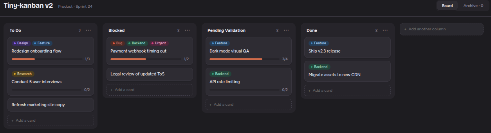
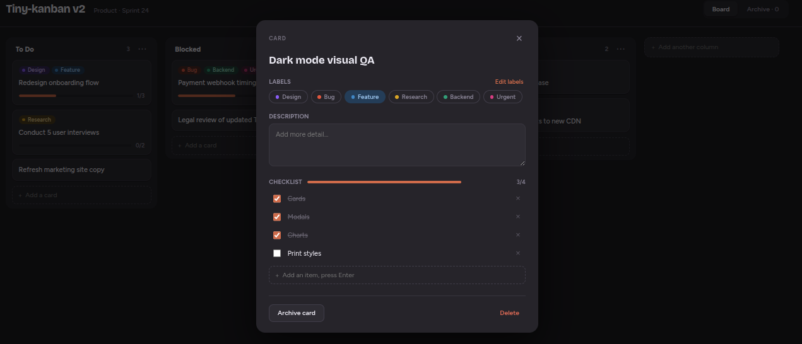

# Tiny-kanban v2

[](https://opensource.org/licenses/MIT)

A small dark-themed kanban board ("Flowboard Dark"), implemented from the
[Claude Design](https://claude.ai/design) project *Kanban board design*.

React frontend (display), Python backend (FastAPI + SQLAlchemy + Alembic)
owning all board logic, data in a local SQLite file, and an MCP server so
LLM clients can query **and update** the board:

```bash
claude mcp add --transport http tiny-kanban http://127.0.0.1:8000/mcp
```
## Dashboard

## Card


## Quick start

Requires [uv](https://docs.astral.sh/uv/) and Node.js.

```bash
./start.sh          # build the UI once and serve everything at http://127.0.0.1:8000
./start.sh dev      # development: backend auto-reload + Vite HMR
```

Ports and the database path are configurable — copy `.env.example` to `.env`.

## Features

- Columns: add, rename inline, delete (cards move to the archive), archive all cards
- Cards: add (Enter in the column footer), drag & drop between/within columns
  with a drop indicator, open in a modal
- Card modal: edit title & description, toggle labels, checklist with progress
  bar, archive or delete
- Labels: shared across the board — create, rename, recolor (8-color palette),
  delete from the "Edit labels" panel in the card modal
- Archive view: search, restore to the original column, permanently delete

Behavior toggles (confirmation dialogs, new-card position, archive sort order)
live in `frontend/src/config.ts`.

## Tests

```bash
cd backend && uv run pytest    # the thorough suite
cd frontend && npm test        # minimal API-client tests
```

Architecture, data model, and contribution guide (for humans and LLM agents):
see [AGENTS.md](AGENTS.md).

## ⚠️ Disclaimer

**This is a personal learning project** created for educational purposes and to experiment with AI-assisted development. It was built to:
- Explore full-stack development patterns
- Learn new technologies and frameworks
- Test AI development tools and workflows

**Use at your own risk.** While functional, this project is not intended for production use without proper review, testing, and security hardening. See the [LICENSE](LICENSE) for full terms.

## Development

This project was developed with assistance from Claude (Anthropic's AI assistant).

